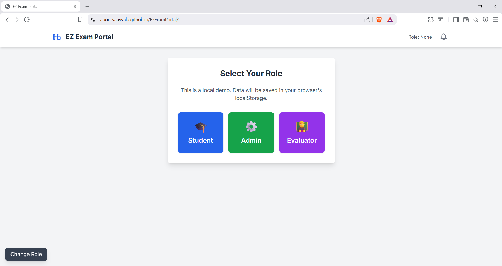
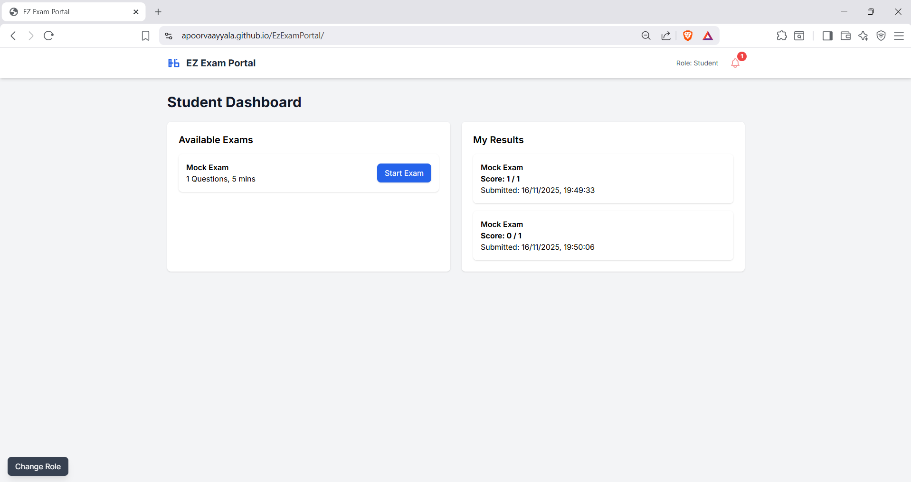
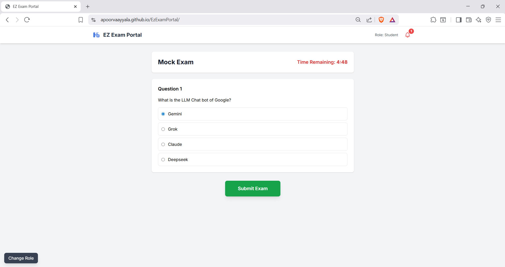
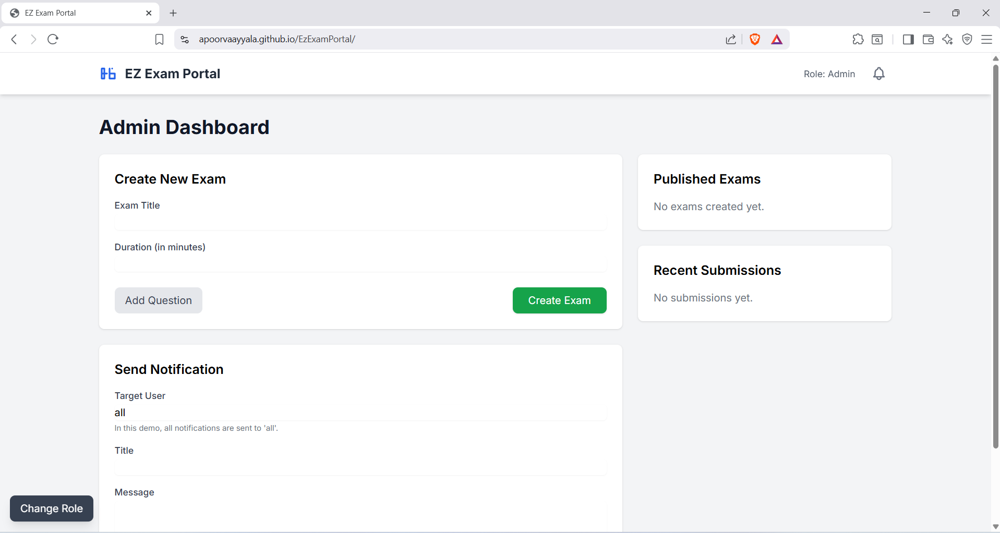
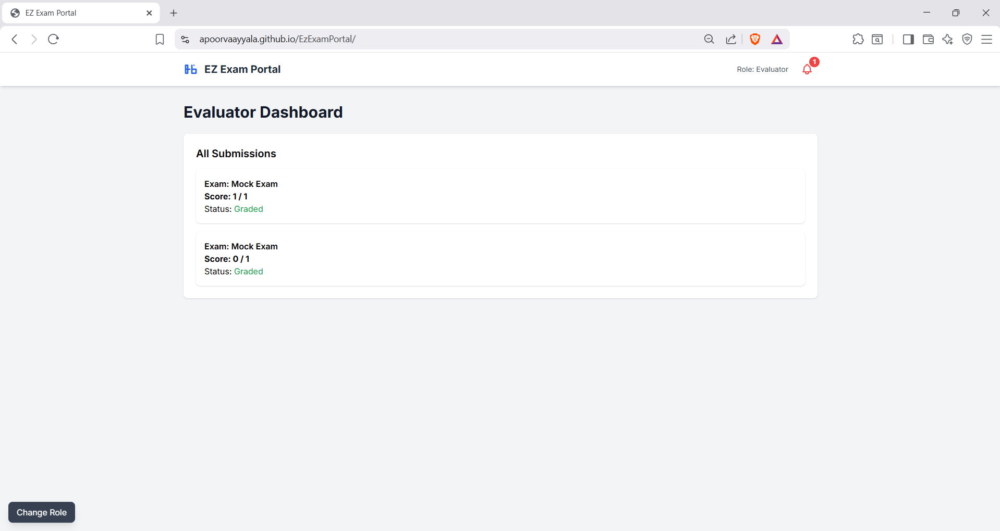

# EzExamPortal
Online Exam Portal (Demo)

This is a single-page web application that demonstrates the UI and workflow for an online exam portal. It is 100% front-end and uses your browser's localStorage to simulate a database. This means it requires no backend, no database setup, and can be hosted for free on any static site host (like GitHub Pages).

## View a Live Demo Here

[EZExamPortal](https://apoorvaayyala.github.io/EzExamPortal/)

### Features

#### Role-Based Views: 
A single-page application that shows different dashboards for three distinct user roles:

### 🎓 Student: Can view a list of available exams, take any exam under a timer, and see their auto-graded results.

### ⚙️ Admin: Can create new exams with multiple-choice questions, view all exams in the system, and see all submissions.

### 🧑‍🏫 Evaluator: Can view a dashboard of all student submissions for review.

### Other Features include:

1. Persistent Data: Uses the browser's localStorage to save all created exams, submissions, and notifications, so data persists even after you close the browser tab.

2. Timed Exams: The student's exam session is timed, and the exam auto-submits when the timer runs out.

3. Auto-Grading: Multiple-choice questions are automatically graded on submission.

4. Notification System: Admins can send broadcast notifications that are displayed to students.

### Tech Stack

This project is built to be as simple as possible, using only front-end technologies:

1. HTML5: For the core structure and content.

2. Tailwind CSS: For all styling and UI components. Loaded via a CDN.

3. Vanilla JavaScript (ES6+): For all application logic, including:

Switching between user "views" (pages).

Handling form submissions.

Managing the exam timer.

Saving and retrieving data from localStorage.

### How to Run This Project

You have two easy options:

1. Run Locally

Since this is just a single HTML file, no server is needed.

Download the index.html file.

Double-click it to open it in your web browser.

2. Host for Free on GitHub Pages

This is the best way to share your project.

Create a Repository: Create a new, public repository on GitHub.

Upload the File: Upload the index.html file to this repository.

Enable Pages: In your repository's Settings > Pages tab:

Set the Source to "Deploy from a branch".

Set the Branch to main.

Click "Save".

Wait & Share: After 1-2 minutes, GitHub will provide you with a live URL (e.g., https://your-username.github.io/your-repo-name/).

### Code Explanation

All the application logic is inside the <script> tag in index.html. Here is a breakdown of how it works:

#### 1. LocalStorage Helper Functions

The app's "database" is managed by two functions:

getData(key): This function gets an item from localStorage (e.g., the list of 'exams') and parses it from a JSON string into a JavaScript array.

saveData(key, data): This function takes a JavaScript array (e.g., your new list of exams) and converts it into a JSON string before saving it to localStorage.

#### 2. Core App Logic

The application is a single page, but it simulates multiple "views" (pages) by showing and hiding div elements.

showView(viewToShow): This is the main navigation function. It hides all views (view-auth, view-dashboard-admin, etc.) except for the one specified.

selectRole(role): This is called when you click a role button. It saves the userRole and then calls the correct function (e.g., loadAdminDashboard()) to show the right view.

#### 3. Admin Dashboard (loadAdminDashboard)

handleCreateExam(event): This function is triggered by the "Create Exam" form.

It prevents the page from reloading (event.preventDefault()).

It reads the title, duration, and all the question fields from the form.

It bundles this data into a new exam object.

It calls getData('exams') to get the current list, push()es the new exam onto the list, and then calls saveData('exams', ...) to save the updated list.

Finally, it shows a "Success" toast and re-renders the admin's exam list.

#### 4. Student Workflow (loadStudentDashboard)

renderStudentExamsList(): This calls getData('exams') and creates an HTML element for each exam, adding a "Start Exam" button to each one.

startExam(examId): When a student clicks "Start Exam":

It finds the correct exam data from localStorage using the examId.

It saves this data to a global variable (currentExamData).

It populates the view-exam-taking screen with the exam title and questions.

It starts the countdown timer (examTimer = setInterval(...)).

recordAnswer(questionIndex, optionIndex): As the student clicks radio buttons, this function saves their answers to the currentExamAnswers object.

handleSubmitExam(): When the student submits (or the timer runs out):

The timer is stopped.

The code loops through the currentExamData.questions and compares the correct answer with the student's answer in currentExamAnswers.

It calculates a score.

A new submission object is created with the score, title, and timestamp.

This new submission is saved to localStorage using saveData('submissions', ...).

The student is shown their score in a toast and sent back to their dashboard.

#### 5. Notification System

handleSendNotification(event): The admin form for notifications is very simple. It just gets the title and message and saves it as a new object in the 'notifications' list in localStorage.

loadNotifications(): When the student dashboard loads, this function calls getData('notifications') and builds the HTML for the notification modal, showing a count on the bell icon.
